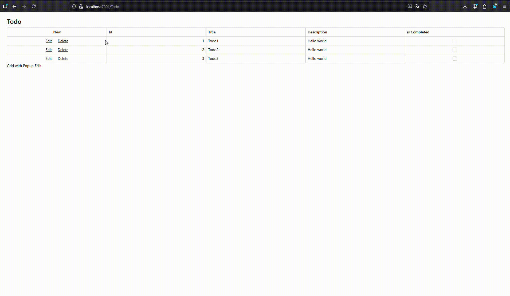
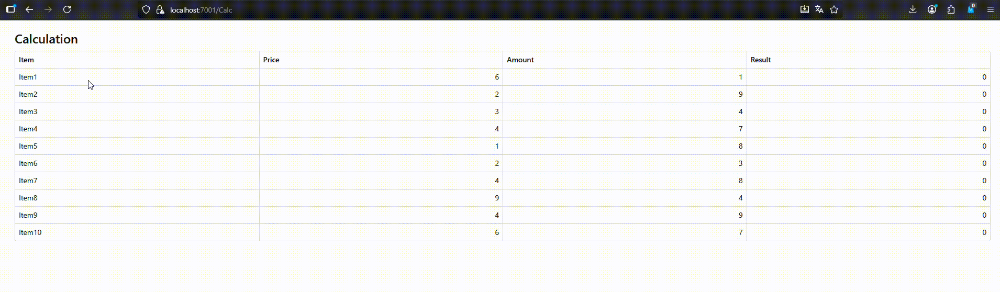
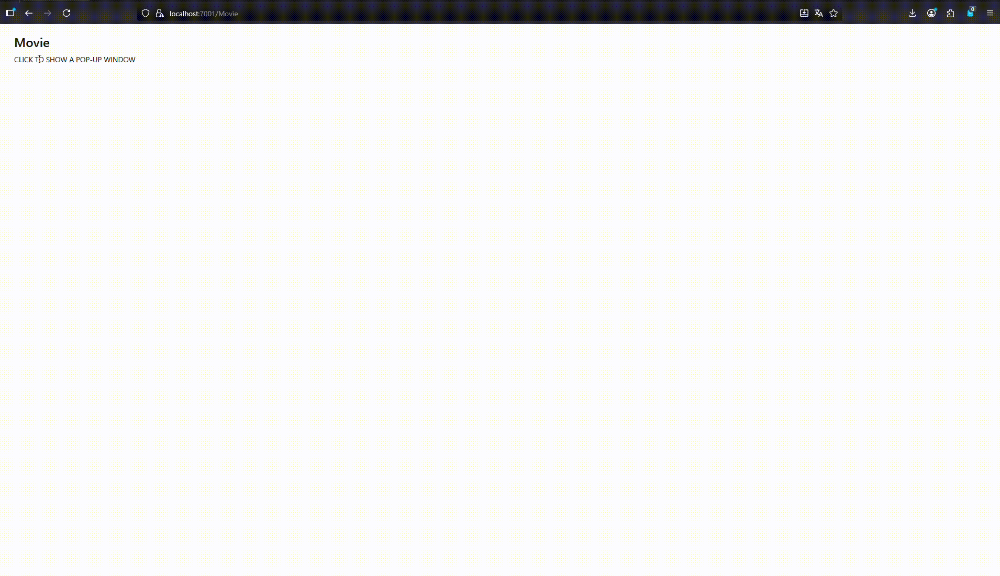
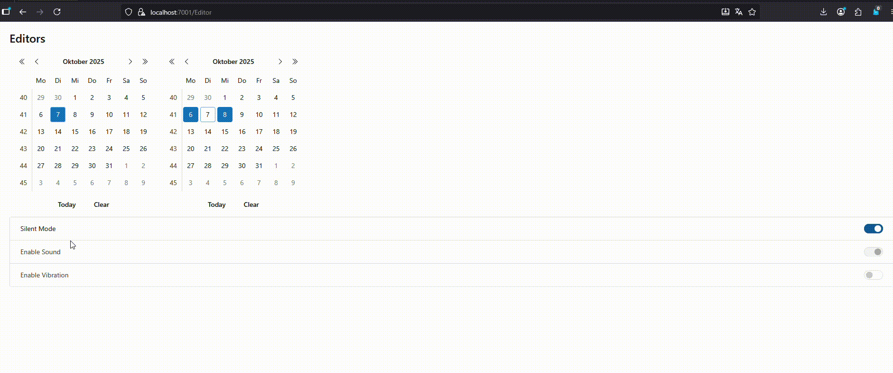
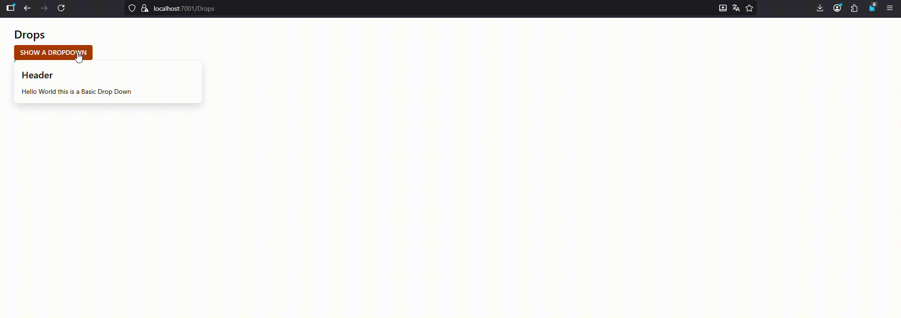

# DevExpress Blazor Components

Meine Lösung der Blazor Aufgabe

## Screenshots

Das ist ein Beispiel für `DxGrid` und Forms

Das ist ein Beispiel für `DxGird` mit `GridEditMode.EditCell`

Das ist ein Beispiel für `Popup` und `Tree`

Das ist ein Beispiel für verschidene `Data Editors`

Das ist ein Beispiel für `Dropdowns`

Das ist ein Beispiel für `Toasts`, `Progressbars` und `Wait Indicator`